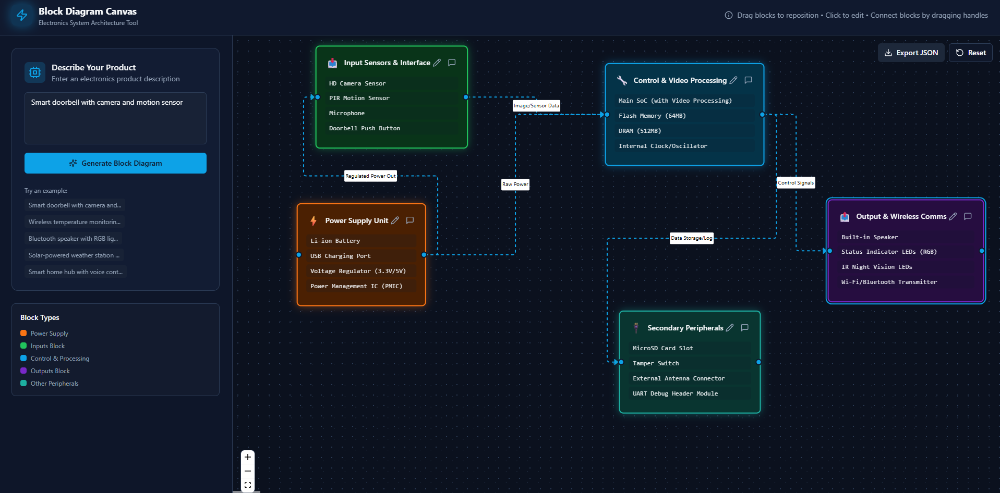

# Interactive Block Diagram Canvas

An interactive web-based application that generates editable block diagrams
of electronics products from natural language descriptions.

---

## Problem Statement

Design a web-based canvas that accepts a textual description of an electronics
product and automatically generates a structured block diagram that can be
edited and annotated by the user.

The generated diagram must always contain exactly five system blocks:
- Power Supply
- Inputs Block
- Control and Processing Block
- Outputs Block
- Other Peripherals

---

## Features

- Natural language input for electronics product descriptions
- Automatic generation of exactly five system blocks
- Interactive drag-and-drop canvas
- Editable blocks, components, and connections
- Sensible default components for incomplete inputs
- Machine-readable diagram structure
- Clean and responsive UI

---

## System Architecture

The application follows a component-based architecture:
- User input is analyzed and mapped to predefined electronics component templates
- Components are grouped into standard system blocks
- The diagram is rendered on an interactive canvas
- Users can modify layout, content, and connections

---

## Tech Stack

- React (JavaScript)
- Vite
- React Flow
- Tailwind CSS

---

## How Diagram Generation Works

The system parses keywords from the user’s input and maps them to relevant
electronics components. If some details are missing, the system fills the
corresponding blocks with sensible default components to ensure that the
five-block structure is always maintained.

---
## Application Screenshots

### 1. Initial State (No Diagram Generated)
This screen shows the application before any input is provided.


### 2. Generated Block Diagram
This screen shows a generated block diagram for an electronics product
(e.g., smart doorbell with camera and motion sensor).




## Run Locally

```bash
npm install
npm run dev


